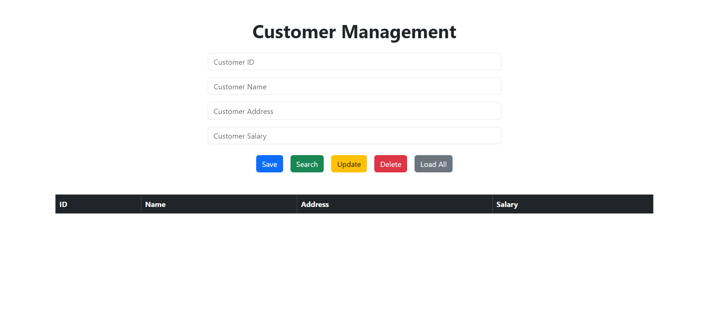

# MERN-CRUD Application

## Overview

This project is a basic CRUD (Create, Read, Update, Delete) application built with the MERN stack (MongoDB, Express,
React, Node.js). It provides a simple customer management system where you can perform CRUD operations on customer data.

## Features

- Create a new customer
- Read customer details
- Update existing customer information
- Delete a customer
- Load all customers

## Technologies Used

- **MongoDB**: A NoSQL database for storing customer data.
- **Express**: A web application framework for Node.js.
- **React**: A JavaScript library for building user interfaces.
- **Node.js**: A JavaScript runtime built on Chrome's V8 JavaScript engine.
- **Axios**: A promise-based HTTP client for the browser and Node.js.
- **Bootstrap**: A framework for building responsive, mobile-first websites.
- **TypeScript**: A typed superset of JavaScript that compiles to plain JavaScript.

## Prerequisites

- **Node.js**: 12.x or later
- **npm**: 6.x or later
- **MongoDB**: 4.x or later
- **IDE**: VSCode, WebStorm, or any other JavaScript IDE

⭐️If you hava any bugs or issues ,If you want to explain code please contact me on : 
[kavithmathushal9007@gmail.com](https://www.kavithmathushal9007@gmail.com)  

#### This project is licensed under the [Apache License](LICENSE)

#### © 2024 All Right Reserved, Designed By [Kavithma Thushal](https://github.com/Kavithma-Thushal)

